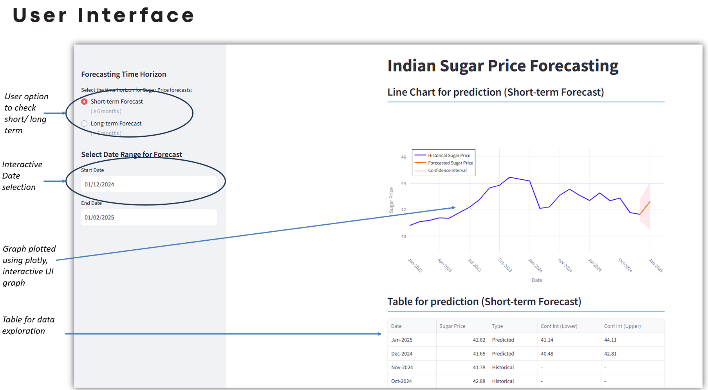

# SugarPriceForecasting
Building an end to end ML Project for predicting Sugar Prices to minimize sugar procurement cost [Forecasting] [SARIMA] [MySQL] [Streamlit]

## High-level Solution
Forecast the sugar prices so that sugar can be procured from the most feasible markets by considering various factors such as monthly production (capacity), importing/exporting quantities, in addition to macro-economic factors such as inflation %.

### Business Success Criteria
Reduce the Sugar procurement costs by at least 10%

### ML Success Criteria
Achieve a model accuracy of at least 80%

### Economic Success Criteria
Government’s ability to make sugar available in during uncertain times (controlling CPI/WPI for Sugar) and the ability to dictate the duties/tax for sugar for related products (ex: ethanol)

## Architecture Diagram

## UI
